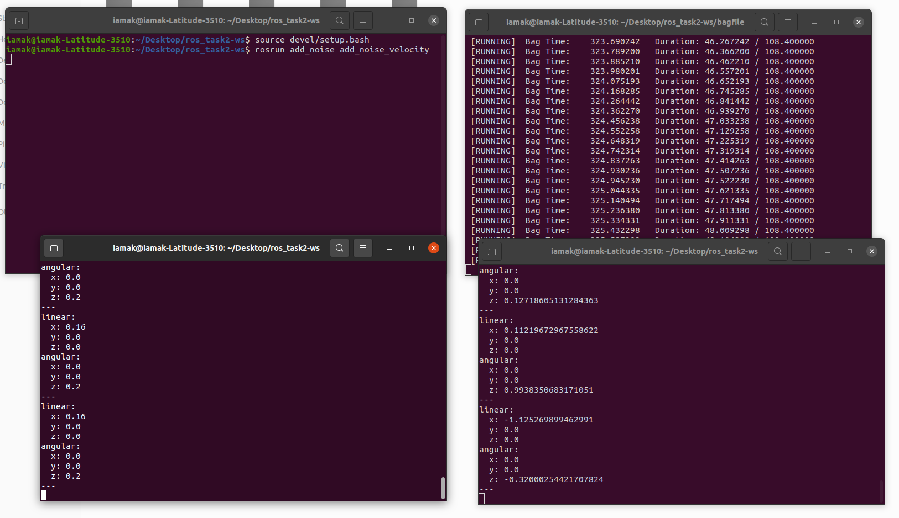

# turtlebot3-velocity_addNoise
Read velocity of the turtlebot3 from a recorded bag file, add some gaussian noise to it and publish it to a new topic

## Adding noise to velocity and publishing it to a new topic
Open 5 separate terminal windows and after moving to the turtlebot3-velocity_addNoise directory, source the proper setup file
```bash
source ./devel/setup.bash
```
  
- Terminal 1: run `roscore`
- Terminal 2: 
```bash 
rosrun add_noise add_noise_velocity
```
- Terminal 3:
```bash
cd bagfile
rosbag play <bagfile_name>.bag #choose one of the files present in this directory
```
- Terminal 4: (shows actual velocity)
```bash
rostopic echo /cmd_vel
```
- Terminal 5: (shows velocity with added noise)
```bash
rostopic echo /velocity_noise_added
```
  
### Sample output

